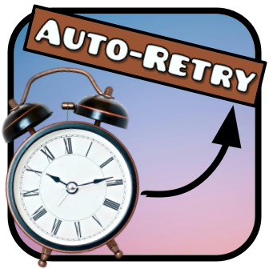

# Time Anti-restart

Turns off the Geometry Dash setting for auto-restart if the time is set past a given time.

Also thank you Claude 3.5 Sonnet for helping me as I dont know C++ very well (yes i still made most of it myself, but bugfixing and learning was helpful)